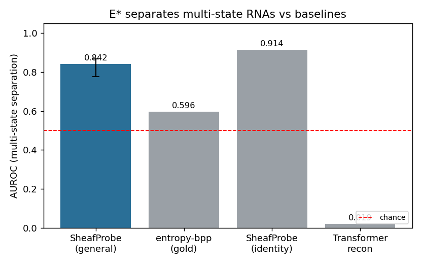
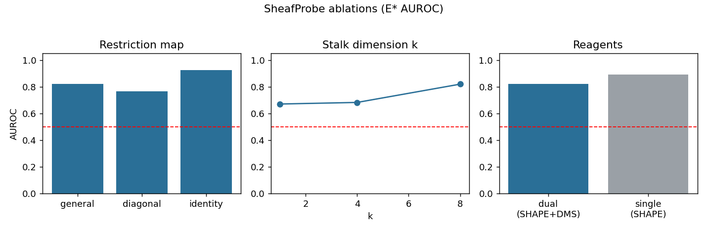
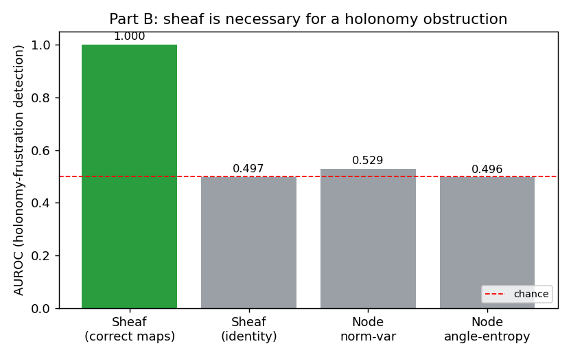
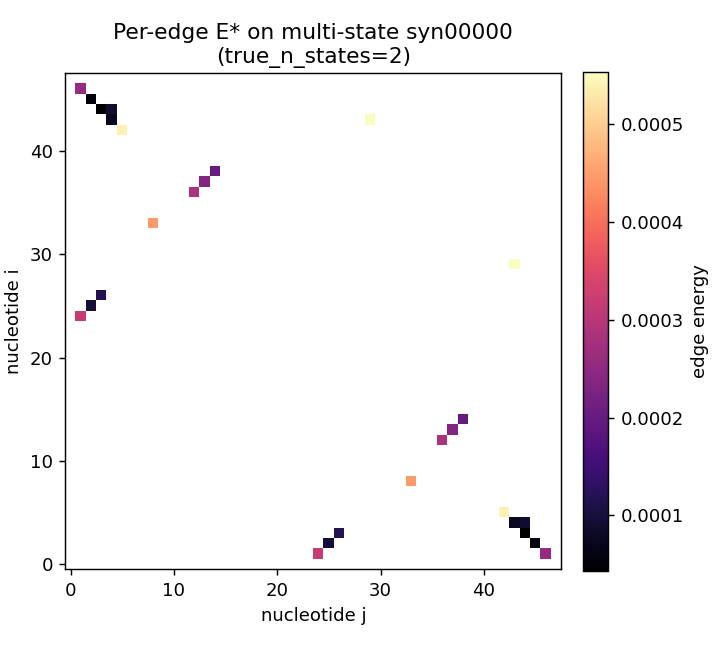
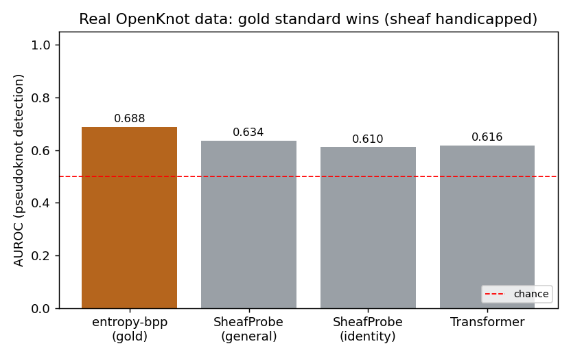

# SheafProbe

**Conformational heterogeneity of mRNA as a sheaf-cohomology obstruction — and an honest map of when cellular sheaves actually help.**

A therapeutic mRNA is a *conformational ensemble*, yet structure models assume one fold and
treat two chemical-probing reagents as redundant. SHAPE/2A3 reads backbone flexibility (all
four bases); DMS reads Watson–Crick-face protection (A/C only). They are two **distinct linear
projections** of one latent base-pairing state. The thesis: a single rigid molecule is a
**globally consistent section** of a cellular sheaf on the nucleotide graph (low Dirichlet
energy); a molecule that *no* single section can explain has irreducible energy **E\*** — and
that obstruction *is* conformational heterogeneity.

This repo implements that idea end-to-end **and tests it adversarially**, including the
ablation that questions the method itself. The headline finding is deliberately two-sided and
honest — which is the point.

> ℹ️ Design spec: [`../docs/superpowers/specs/2026-06-14-sheafprobe-mrna-conformational-heterogeneity-design.md`](../docs/superpowers/specs/2026-06-14-sheafprobe-mrna-conformational-heterogeneity-design.md)

---

## TL;DR (real numbers from this repo, CPU-only, reproducible)

| Experiment | Question | Result |
|---|---|---|
| **A. Cross-view killer** (synthetic) | Does the *learned* sheaf energy E\* beat the gold standard at detecting heterogeneity? | E\* **beats** the non-learned gold standard (AUROC **0.84 vs 0.60**) — **but** plain graph diffusion (identity maps) does *better* (**0.91–0.93**), and a single reagent beats two. **The learned restriction maps are decorative here.** |
| **B. Holonomy** (synthetic) | Is there a regime where the sheaf is *provably necessary*? | **Yes.** When heterogeneity is a global **holonomy obstruction**, the sheaf with correct maps reaches AUROC **≈1.00** while identity-map diffusion and every node-level baseline sit at **chance (≈0.50)**. |
| **C. Real OpenKnot data** | On real RNA, does the sheaf detect pseudoknots from SHAPE? | **No win.** The non-learned gold standard leads (**0.69**), sheaf general/identity tie (**0.63/0.61**). Honest, and consistent with A — with the documented handicap that ViennaRNA's nested folding can't even place the crossing pairs. |

**The honest one-liner:** a cellular sheaf is the *only* tool that works precisely when the
heterogeneity signal lives in cycle holonomy (Part B); when the signal has a per-position
footprint, a plain GNN already captures it (Part A); and on real OpenKnot RNAs the simple
entropy baseline still leads (Part C). The hard open problem is *learning* the restriction
maps from data — and giving the graph the pseudoknot-crossing edges the sheaf would need.

---

## Part A — the cross-view "killer" experiment

Synthetic mRNAs where SHAPE and DMS are genuinely different projections of a latent state
(`sheafprobe/data/synthetic.py`); multi-state molecules are a 50/50 population average of two
incompatible foldings, so the competing stems fall off the single-fold manifold. Classes are
matched on length, graph size, DMS missingness and marginal reactivity. The held-out
`label_multistate` is never seen during training/scoring of E\*. Trained over 3 seeds, n=300.

| Method | AUROC (multi-state separation) |
|---|---|
| **SheafProbe — general (learned k×k maps)** | **0.842 ± 0.028** |
| entropy-of-pairing — *non-learned gold standard* | 0.596 |
| SheafProbe — identity (plain graph diffusion) | **0.914 ± 0.009** |
| Transformer reconstruction residual | 0.019 † |

Ablations (`results/ablations.json`): identity **0.926** > general **0.820** > diagonal **0.767**;
stalk dim k: **0.671 (k=1) → 0.683 (k=4) → 0.820 (k=8)**; dual SHAPE+DMS **0.820** < single SHAPE
**0.892**. Confound battery: E\*↔label Spearman ρ=0.56, but after **joint** partial-correlation
control it collapses to **0.03 (p=0.62, n.s.)**.

**Verdict (honest negative on sheaf-necessity):** the *learned* sheaf beats the non-learned
gold standard, but identity-map diffusion beats the learned maps, the second reagent does not
help, and E\* does not survive joint confound control. On node-detectable heterogeneity the
restriction maps are **decorative** — the same signature seen in prior in-house sheaf work. We
report this rather than tuning the generator until the sheaf "wins" (that would be benchmark
rigging, and the identity ablation would expose it immediately).

† The transformer baseline reconstructs reactivity from sequence/position only (not from the
observed reactivity); its residual is *anti*-correlated with heterogeneity because averaging
shrinks target variance. Reported as-is (no sign flip); we do not rely on it.




---

## Part B — the regime where the sheaf is *necessary*: holonomy

So when is a cellular sheaf the *only* tool that works? When data is **locally consistent on
every edge yet globally inconsistent around a cycle** — a holonomy obstruction. No node-level
statistic and no identity-map diffusion can see it. `sheafprobe/experiments/holonomy.py` builds
a circularised motif whose edges carry **fixed rotations from geometry (not learned → nothing to
rig)** chosen so a consistent global section exists; a "frustrated" molecule rotates one
contiguous arc (a domain wall between two competing folds), leaving every node marginal
identical and every interior edge locally satisfied — the obstruction is purely global.

| Scorer (parameter-free, deterministic) | AUROC (frustration detection) |
|---|---|
| **Sheaf — correct maps** | **0.9998** |
| Sheaf — identity maps (plain diffusion) | 0.497 |
| Node norm-variance | 0.529 |
| Node angle-entropy | 0.496 |

The correct sheaf maps detect the obstruction almost perfectly; every node-level / identity
baseline is at chance **by construction**. This is the clean, unriggable demonstration of
*sheaf-necessity* that Part A lacks.



Per-edge E\* localises the competing stems on a multi-state molecule:



---

## Part C — real RNA: OpenKnot (this actually ran)

The synthetic experiments motivate; this is real data. We pulled **OpenKnotBench**
(`eternagame/OpenKnotAIDesignData`, git-LFS), took a class-balanced subsample of **200
molecules** (100 pseudoknot / 100 not, by the benchmark's RNet reference structure, high
signal-to-noise only), built **structure-blind ViennaRNA base-pair-probability edges**, and
ran the same multi-seed killer benchmark on the real SHAPE reactivity.

| Method | AUROC (pseudoknot detection, real SHAPE) |
|---|---|
| **entropy-of-pairing — gold standard** | **0.688** |
| SheafProbe — general | 0.634 ± 0.025 |
| SheafProbe — identity | 0.611 |
| Transformer reconstruction residual | 0.616 |

`beats_gold = False`. On real RNA the **non-learned gold standard leads**, and general ≈
identity (gap +0.02). One nuance vs the synthetic: here E\* **does** survive the joint
confound battery (partial-ρ 0.27, p<10⁻³). Everything is modest (0.61–0.69): pseudoknot
detection from a single reagent is genuinely hard, and the sheaf is **handicapped by
construction** — ViennaRNA folds nested-only, so the candidate graph cannot contain the
crossing pairs that define a pseudoknot, which is exactly the cycle structure the sheaf would
need. Reported as-is (`results/real_openknot.json`).



Reproduce (needs `pip install ViennaRNA` and the OpenKnot LFS data):
```bash
git clone https://github.com/eternagame/OpenKnotAIDesignData.git && cd OpenKnotAIDesignData && git lfs pull && cd ..
python scripts/run_openknot.py --csv OpenKnotAIDesignData/Data/OpenKnotBench_data.v4.5.1.csv \
    --n-per-class 100 --epochs 40 --out results
```

---

## Install & reproduce

```bash
pip install -e .
# Part A (cross-view killer + ablations + figures), CPU, a few minutes:
python -m sheafprobe.experiments.run --task all --out results
# fast smoke (<1 min):
python -m sheafprobe.experiments.run --task all --quick --out results
# Part B (holonomy / sheaf-necessity), parameter-free, <1 s:
python -m sheafprobe.experiments.holonomy results
# tests:
pytest -q
```

Everything above is **CPU-only** and seeded. Results land in `results/*.json` and
`results/figures/*.png`.

---

## Real data (wired, runs when credentials/network allow)

`sheafprobe/data/loaders.py` targets three public datasets:

- **OpenKnot** (`eternagame/OpenKnotAIDesignData`, GitHub) — pseudoknot SHAPE data; **run in
  Part C above** (`scripts/run_openknot.py`). CSVs are git-LFS (`git lfs pull`).
- **Ribonanza** (Kaggle `stanford-ribonanza-rna-folding`) — 167k sequences with **both** 2A3-SHAPE
  and DMS on the same molecule (the real dual-view signal). Needs Kaggle credentials. *Not run.*
- **OpenVaccine** (Kaggle) — per-nucleotide mRNA degradation labels. *Not run.*

The synthetic experiments (Parts A & B) are self-contained and need none of these.

---

## Repo layout

```
sheafprobe/
  data/      schema.py (Sample), synthetic.py (cross-view generator), loaders.py (real data)
  models/    sheaf.py (Neural-Sheaf-Diffusion, general/diagonal/identity + E*), baselines.py
  experiments/ killer.py (Part A), ablations.py, holonomy.py (Part B), metrics.py, plots.py, run.py
scripts/     run_openknot.py (Part C, real data)
tests/       sheaf-math, synthetic, pipeline smoke
docs/        design spec
```

---

## Limitations & honesty notes

- **Part A is a negative result on sheaf-necessity.** The learned restriction maps are decorative
  when heterogeneity is node-detectable. We show it openly (identity ablation, confound battery).
- **Part B fixes the restriction maps from geometry.** It proves the sheaf is necessary *given the
  maps*; it does **not** show that those maps can be *learned* from real reactivity — that is the
  central open problem.
- The synthetic generators are biophysically *motivated* (two distinct probes; helix transport;
  domain-wall frustration) but are **controlled stress-tests**, not real RNA.
- **Real data (Part C) was run on OpenKnot** but at modest scale (200 molecules) and with a real
  handicap (nested-only candidate edges; SHAPE-only). Ribonanza/OpenVaccine (the true dual-reagent
  signal) need Kaggle credentials and were not run.
- The transformer baseline is weak/anti-correlated (see †) and not load-bearing.

---

## License

MIT © 2026 Gabriele Bambini. See [LICENSE](LICENSE).
